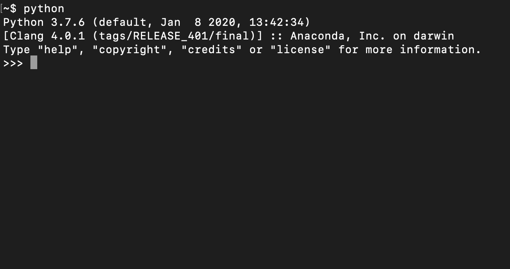
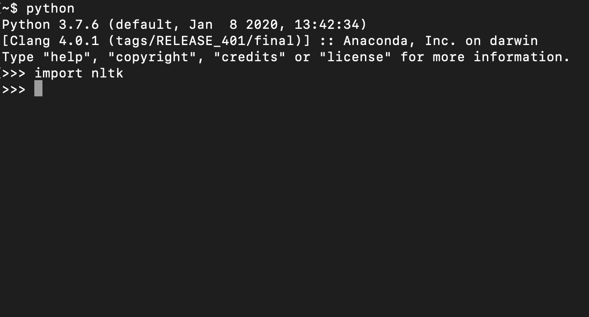
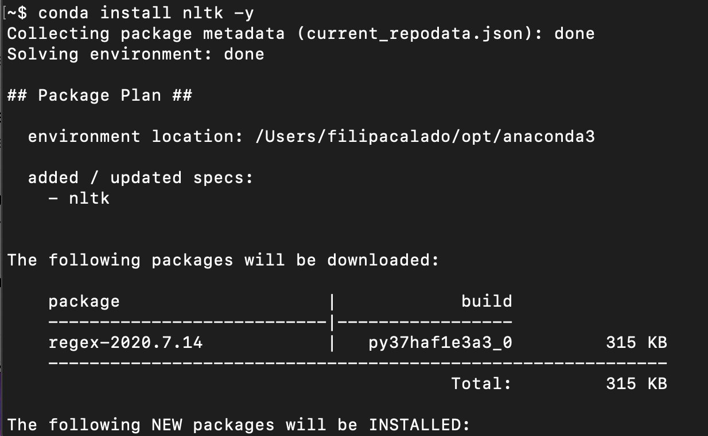
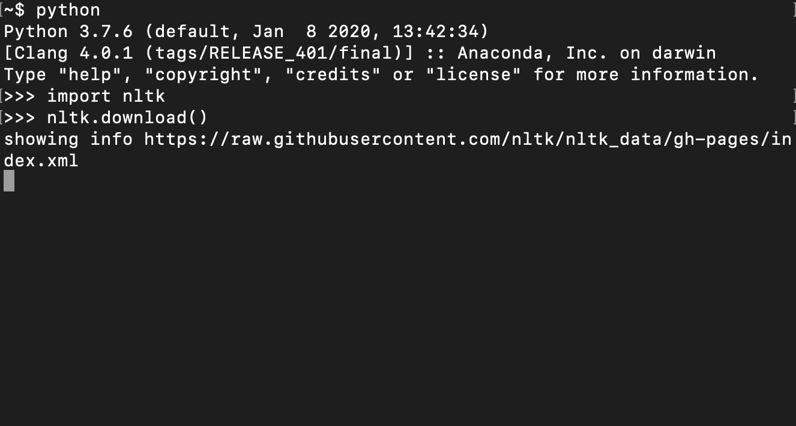
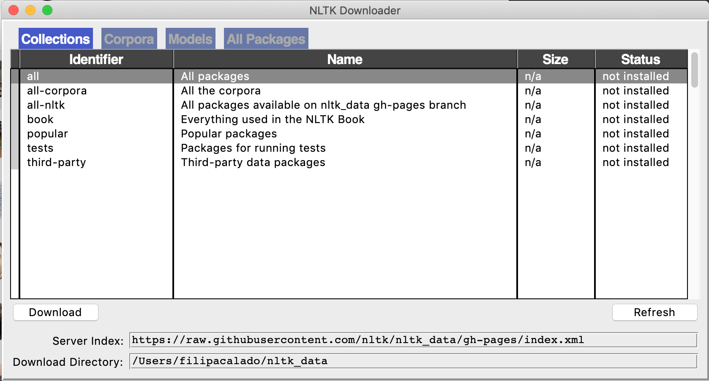
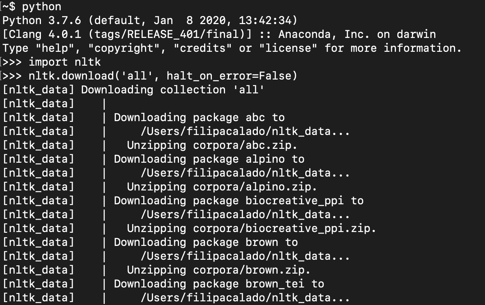
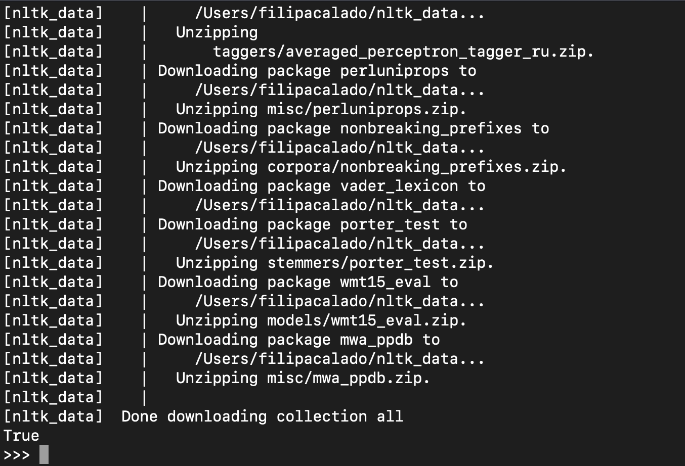
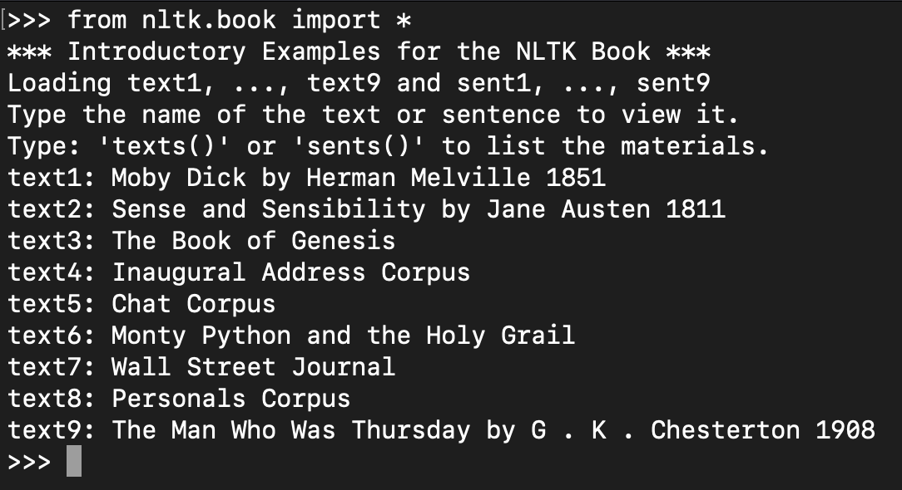

# Natural Language Toolkit

## What it is

[NLTK](http://www.nltk.org/) stands for Natural Language Tool Kit, and it is an open source Python library for analyzing language data. It is used for Python programs that work with text in statistical natural language processing (NLP). In plain terms, NLTK allows users to work with collections of text to clean, categorize, and analyze that text. As such, it is an excellent tool for text analysis.

ATTENTION: NLTK comes installed with the [conda](conda.md) package managment system and may already be installed in your environment.

## Why we use it

For the Digital Humanities Research Institute, we use NLTK because it is a rich library of natural language processing tools and datasets. It works very well with Python, allowing users to write powerful natural language processing programs with relatively short sections of code. 

## Installation instructions: macOS Catalina

Before getting startied, there are some things to note about software versions. First, these installation instructions work with recent versions of Mac OS X, like Catalina, Mojave, High Sierra, and they *should* work with older versions as well. 

Second, if you have completed the Python workshop, you have probably downloaded the Anaconda package. Therefore, you may already have NLTK installed on your computer. The below instructions begin with an NLTK check and, in the case that you do not have NLTK installed, walk you through the installation.

Finally, NLTK requires Python versions 3.5, 3.6, 3.7, or 3.8. The most recent Anaconda installation (which you downloaded for the Python workshop) comes with Python 3.8, so you should already have the relevant version of Python.

### Step 1: Checking if NLTK is already installed

Open an OSX terminal and type `python` to launch a Python interpreter. You should get something like this:



Load NLTK by typing the following in your environment and *pressing* 'enter':



If this step fails, you will get an error, and you should  follow the next step, Install NLTK. If it is already installed, nothing will happen and you'll see the three `>>>` in the window. In that case, skip to Step 3, [Install NLTK Data](#step-3:-install-nltk-data-with-the-gui-(mac)).

### Step 2: Install NLTK (MAC)

Exit the Python interpreter (`control-d` or `quit()`. Once you're back in your terminal, type:

```console
$ conda install nltk -y
```

When you press enter, the terminal should look something like the following:



When it's finished, go back into the Python interpreter to import NLTK, typing `import NLTK` after the `>>>`. If it downloaded correctly, nothing will happen and you'll see the three `>>>` in the window.  In that case, continue to step 3.

### Step 3: Install NLTK Data with the GUI (MAC)

You then need to install the data that NLTK relies on to function. This may take several minutes (depending on your internet connection). Some packages may fail installation due to being outdated - this is alright, and will not be a problem for our lessons. If you get an error about a package failing, just shut down the install and skip to [installing NLTK with the command line](#step-4:-install-nltk-data-with-the-command-line-(mac)).

In your Python environment run the following command *after* import nltk:

```pycon
>>> nltk.download()
```

For example, the interpreter above would now look like:



The Python environment that the GUI was launched from should now have a message that looks something like this:

```pycon
showing info https://raw.githubusercontent.com/nltk/nltk_data/gh-pages/index.xml
``` 

Now, look for the NLTK download GUI - this will appear automatically but may appear hidden behind your browser window or behind where you are working in Python.



Click on the first tab (collections), and on the first record on that tab: all. Then, click the "download" button on the left hand side of that window.

This may take several minutes (depending on your internet connection). *Press* the refresh button if the install is stalling and ignore errors.

If something goes wrong, proceed to [installing NLTK with the command line](#step-4:-install-nltk-data-with-the-command-line). If nothing happens, then skip to the [install test](#step-5:-test-installation-(mac)).

### Step 4: Install NLTK Data with the Command Line (MAC)

NLTK also provides a text based download tool, which you can download with the Command Line.

In your interactive Python environment, type the following commands after importing nltk

```pycon
nltk.download('all', halt_on_error=False)
```

The interpreter above should now look something like:


If the command is successful, the terminal will print out something like:



It will take a few minutes to download. At the end, your terminal should look like this, bringing you back to the python interpreter prompt:



### Step 5: Test Installation (MAC)

When the installation is complete, close the NLTK Downloader and check your installation. You need to be in a Python environment such as an interpreter or Jupyter notebook.

**Brown**

In your Python environment, run the following code:

```pycon
from nltk.corpus import brown
``` 

If your code runs and nothing happens (no error message and nothing printed to the screen), congratulations! 

***Book**

Check that the books corpus installed properly by typing:

```pycon
from nltk.book import *
```

If installed successfully, you should see the following:



**Penn Parts of speech**

Check that the parts of speech tagger is installed correctly by typing the following:

```pycon
nltk.help.upenn_tagset('NN')
```

If installed successfully, you should see the following:


---

## Installation instructions: Microsoft Windows 10

Before getting startied, there are some things to note about software versions. First, these installation instructions work with Microsoft Windows 10.

Second, if you have completed the Python workshop, you have probably downloaded the Anaconda package. Therefore, you may already have NLTK installed on your computer. The below instructions begin with an NLTK check and, in the case that you do not have NLTK installed, walk you through the installation.

Finally, NLTK requires Python versions 3.5, 3.6, 3.7, or 3.8. The most recent Anaconda installation (which you downloaded for the Python workshop) comes with Python 3.8, so you should already have the relevant version of Python.

### Step 1: Checking if NLTK is already installed

Open a Windows terminal (your `command line`) and type `python` to launch a Python interpreter. You should get something like this:

```pycon
$ python
Python 3.6.5 |Anaconda, Inc.| (default, Apr 26 2018, 08:42:37) 
[GCC 4.2.1 Compatible Clang 4.0.1 (tags/RELEASE_401/final)] on darwin
Type "help", "copyright", "credits" or "license" for more information.
>>> 
```
Load NLTK by typing the following in your environment and *pressing* 'enter':

```pycon
Python 3.6.5 |Anaconda, Inc.| (default, Apr 26 2018, 08:42:37) 
[GCC 4.2.1 Compatible Clang 4.0.1 (tags/RELEASE_401/final)] on darwin
Type "help", "copyright", "credits" or "license" for more information.
>>> import nltk
```

If this step fails, you will get an error, and you should follow the next step, Install NLTK. If it is already installed, nothing will happen and you'll see the three `>>>` in the window. In that case, skip to Step 3, [Install NLTK Data](#step-3:-install-nltk-data-with-the-gui-(windows)).

### Step 2: Install NLTK (Windows)

Exit the Python interpreter (`control-d` or `quit()`. Once you're back in your terminal, type:

```console
$ conda install nltk -y
```

The terminal should print something like the following:

```console
Collecting package metadata (current_repodata.json): done
Solving environment: done

## Package Plan ##

  environment location: /Users/filipacalado/opt/anaconda3

  added / updated specs:
    - nltk
```

When it's finished, go back into the Python interpreter to import NLTK, typing `import NLTK` after the `>>>`. If it downloaded correctly, nothing will happen and you'll see the three `>>>` in the window.  In that case, continue to step 3.

### Step 3: Install NLTK Data with the GUI (Windows)

You then need to install the data that NLTK relies on to function. This may take several minutes (depending on your internet connection). Some packages may fail installation due to being outdated - this is alright, and will not be a problem for our lessons. If you get an error about a package failing, just shut down the install and skip to [installing NLTK with the command line](#step-4:-install-nltk-data-with-the-command-line-(windows)).

In your Python environment run the following command *after* import nltk:

```pycon
>>> nltk.download()
```

For example, the interpreter above would now look like:

```pycon
Python 3.6.5 |Anaconda, Inc.| (default, Apr 26 2018, 08:42:37) 
[GCC 4.2.1 Compatible Clang 4.0.1 (tags/RELEASE_401/final)] on darwin
Type "help", "copyright", "credits" or "license" for more information.
>>> import nltk
>>> nltk.download()

The Python environment that the GUI was launched from should now have a message that looks something like this:

```pycon
showing info https://raw.githubusercontent.com/nltk/nltk_data/gh-pages/index.xml
``` 

Now, look for the NLTK download GUI - this will appear automatically but may appear hidden behind your browser window or behind where you are working in Python.


Click on the first tab (collections), and on the first record on that tab: all. Then, click the "download" button on the left hand side of that window.

This may take several minutes (depending on your internet connection). *Press* the refresh button if the install is stalling and ignore errors.

If something goes wrong, proceed to [installing NLTK with the command line](#step-4:-install-nltk-data-with-the-command-line-(windows)). If nothing happens, then skip to the [install test](#step-5:-test-installation-(windows)).

### Step 4: Install NLTK Data with the Command Line (Windows)

NLTK also provides a text based download tool, which you can download with the Command Line.

In your interactive Python environment, type the following commands after importing nltk

```pycon
nltk.download('all', halt_on_error=False)
```

The interpreter above should now look something like:

```pycon
Python 3.6.5 |Anaconda, Inc.| (default, Apr 26 2018, 08:42:37) 
[GCC 4.2.1 Compatible Clang 4.0.1 (tags/RELEASE_401/final)] on darwin
Type "help", "copyright", "credits" or "license" for more information.
>>> import nltk
>>> nltk.download('all', halt_on_error=False)
```

If the command is successful, the terminal will print out something like:

```pycon
[nltk_data] Downloading collection 'all'
[nltk_data]    | 
[nltk_data]    | Downloading package abc to
[nltk_data]    |     /usr/local/share/nltk_data...
[nltk_data]    |   Package abc is already up-to-date!
                ...omitted...
[nltk_data]    | Downloading package mwa_ppdb to
[nltk_data]    |     /usr/local/share/nltk_data...
[nltk_data]    |   Package mwa_ppdb is already up-to-date!
[nltk_data]    | 
[nltk_data]  Downloaded collection 'all' with errors
Out[2]: True
```

### Step 5: Test Installation (Windows)

When the installation is complete, close the NLTK Downloader and check your installation. You need to be in a Python environment such as an interpreter or Jupyter notebook.

**Brown**

In your Python environment, run the following code:

```pycon
from nltk.corpus import brown
``` 

If your code runs and nothing happens (no error message and nothing printed to the screen), congratulations! 

***Book**

Check that the books corpus installed properly by typing:

```pycon
from nltk.book import *
```

If installed successfully, you should see the following:


**Penn Parts of speech**

Check that the parts of speech tagger is installed correctly by typing the following:

```pycon
nltk.help.upenn_tagset('NN')
```

If installed successfully, you should see the following:

