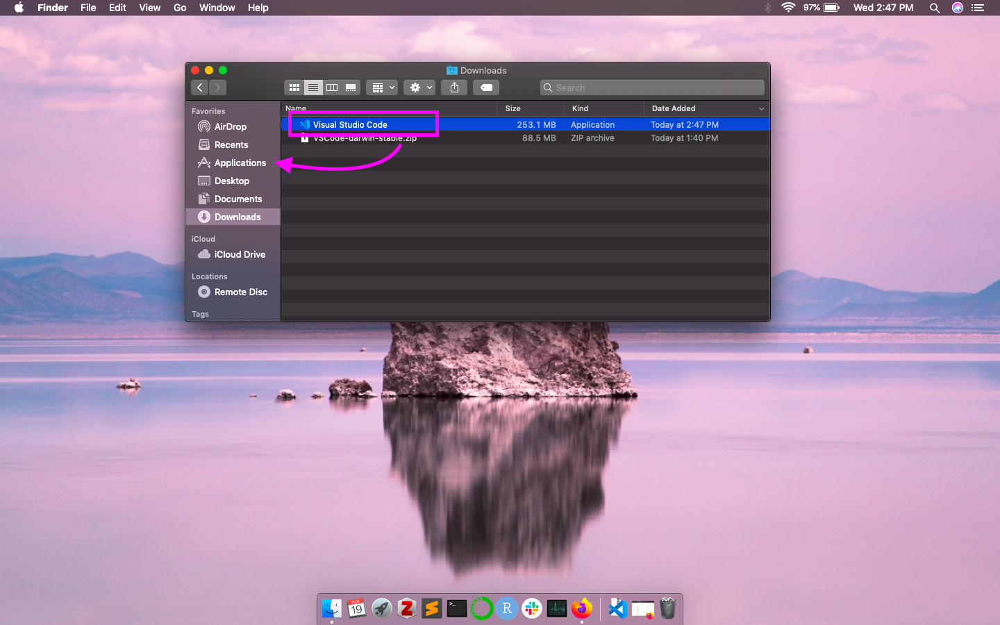
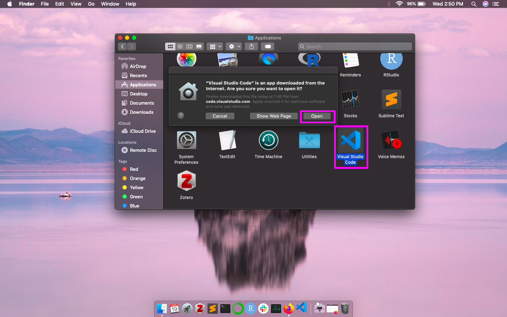
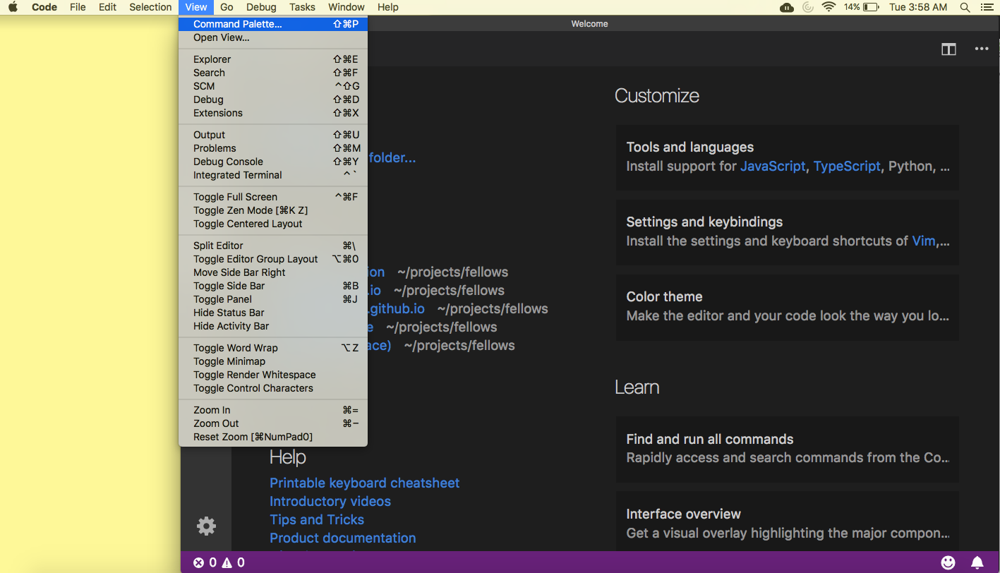
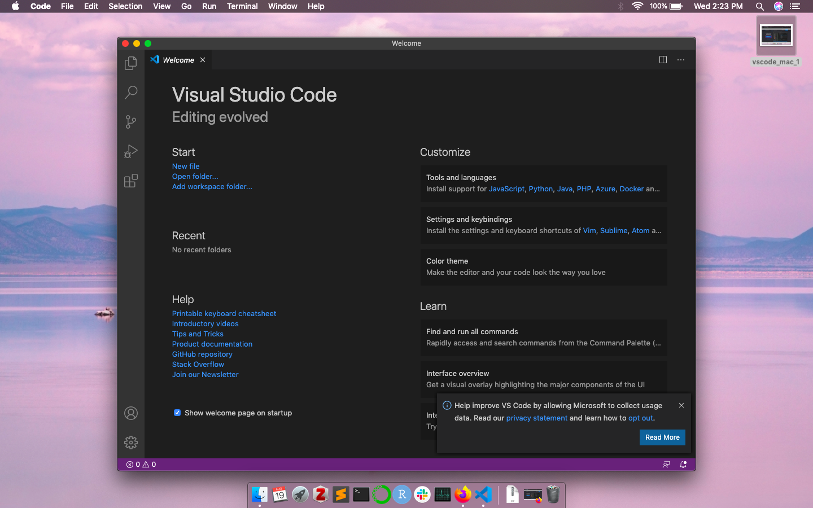
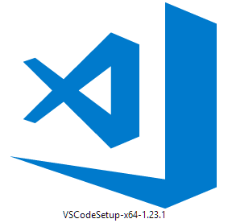
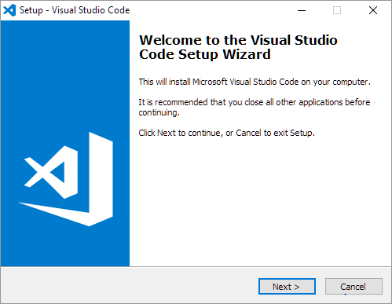
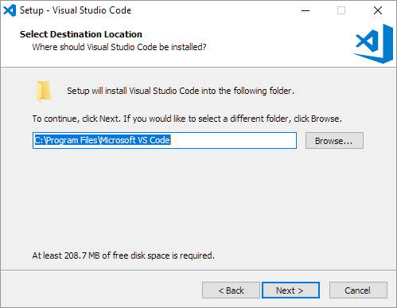
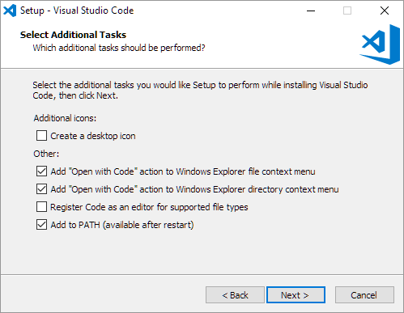
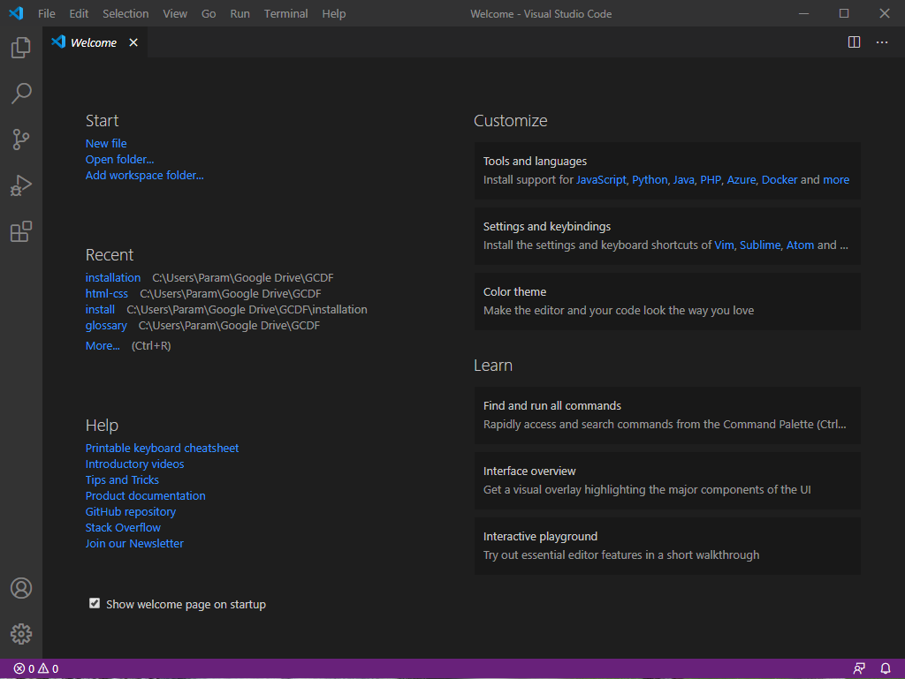

# Microsoft Visual Studio Code

## What it is

Visual Studio Code is a text editor that allows us to write code in a variety of computational languages such as python, HTML, javascript, among others.

## Why we use it

For the Digital Humanities Research Institute, we use Visual Studio Code because it supports [syntax highlighting](https://en.wikipedia.org/wiki/Syntax_highlighting), it is free and built on open source, and it is consistent across Mac, Windows, and Linux systems.

---

## Installation instructions: macOS Catalina

### Step 1: Download Visual Studio Code Installer

Visit the [Visual Studio Code website](https://code.visualstudio.com/) on your internet browser, such as Firefox or Safari, and click `Download for Mac`. Then click `Save File` in the dialogue box that asks if you would like to save the file

### Step 2: Run Visual Studio Code Installer

After the download has completed, double click on the file called `VSCode-darwin-stable.zip` in your Downloads folder. 

### Step 3: Move Visual Studio Code to Applications Folder

Drag the Visual Studio Code application (it will have a blue logo next to it) from your Downloads folder to Applications folder.

### Step 4: Start Visual Studio Code application

Double click the Visual Studio Code application in your Applications folder. The first time you open Visual Studio Code, you should receive a dialogue box that asks you if you are sure you would like to open it. Here you should click `Open`. 

### Step 5: Configure Visual Studio Code I

Navigate to the `View` option in the topmost menu and click `Command Palette`. This will make a text bar appear.

### Step 6: Configure Visual Studio Code II

Type "shell" into the text bar that appears. Then choose `Shell Command: Install code command in PATH`. Click `OK` on the dialogue box that appears saying "Code will now prompt with 'osascript' for Administrator privileges to install the shell command." You may also be asked to provide the password to your computer at this stage.

### Step 7: Complete

Congratulations, Visual Studio Code is now installed in your computer!

---

## Installation instructions: Microsoft Windows 10

### Step 1: Download Visual Studio Code Installer

Visit the [Visual Studio Code website](https://code.visualstudio.com/) on your internet browser, such as Firefox, Edge, or Internet Explorer, and click `Download for Windows`. Then click `Save File` in the dialogue box that asks if you would like to save the file

 

### Step 2: Run Visual Code Installer

Double click on the Visual Studio Code installer in your downloads folder

### Step 3: Walking Through Visual Studio Code Installer I

Click `Next` when the Visual Code setup window opens.

### Step 4: Walking Through Visual Studio Code Installer II

Accept the license agreement by selecting the first radio button. Then click `Next`.

### Step 5: Walking Through Visual Studio Code Installer III

Choose the folder on the computer that Visual Studio Code should be installed in (the default is usually fine). Then click `Next`.

### Step 6: Walking Through Visual Studio Code Installer IV

Choose the folder in the start menu that Visual Studio Code should be installed in. Check the other boxes at your own discretion. Then click `Next`.

### Step 7: Walking Through Visual Studio Code Installer V

Please check the box that says `Add to PATH`. Then click `Next`.

### Step 8: Walking Through Visual Studio Code Installer VI

You should see a window listing the configurations you chose in the previous steps. If they are incorrect, click `Back` and redo the previous steps. If they are correct, click `Install`.

### Step 9: Walking Through Visual Studio Code Installer VII

Sit back and relax because the install will take a while. You should see a window with a progress bar similar to this.

### Step 10: Walking Through Visual Studio Code Installer VIII

Check the `Launch Visual Studio Code` checkbox and then click `Next`.

### Step 11: Complete

Congratulations Visual Studio Code is now installed! You should see something similar to this window when you launch Visual Studio Code.

