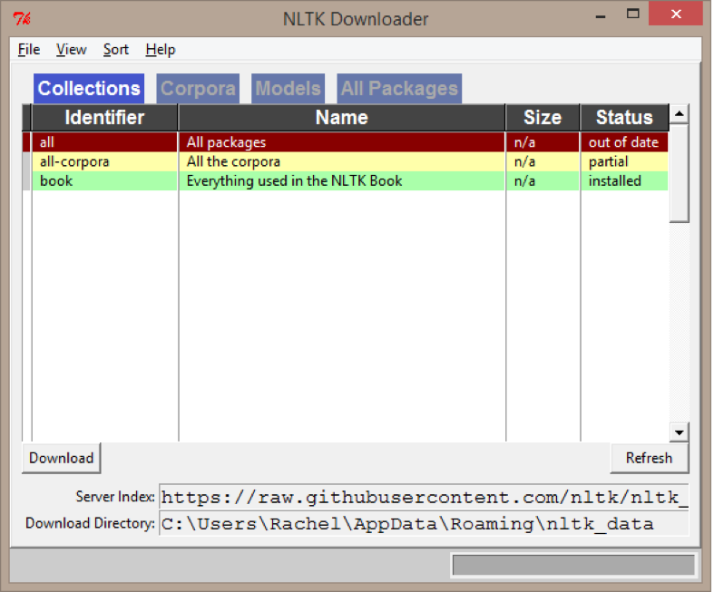

Install Instructions for NLTK 
=============================

[NLTK](http://www.nltk.org/) should already be installed in your Python environment, especially if you are using anaconda as recommended. If
it is not installed, open the [command line]() and type:

```
conda install nltk -y
```

You then need to install the data that NLTK relies on to function. This may take several minutes 
(depending on your internet connection). Some packages may fail 
installation due to being outdated - this is alright, and will not be a problem for the Digital Research Institute. If you get 
an error about a package failing, just shut down the install and move on to the [install test](#test-install).

NLTK Data Using the GUI
-----------------------
1. In your Python environment run the following commands:

```Python
    import nltk
    nltk.download()
```
Here's an example inside a Jupyter notebook:


	
2. Look for the NLTK download GUI - this will appear automatically but will probably be hiding!  
(May appear hidden behind your browser window or behind where you are working in Python).


3. From here, you can choose what you would like to download. We recommend that you download everything, so please select:

```text
all packages, all corpora, and everything from the NLTK book
```


Alternative NLTK data install sing the command line
----------------------------------------------------
 
Open a Jupyter notebook type (1st line then press enter, 2nd line then press enter):

```python
import nltk
nltk.download_shell()
```

This command will likely hang when trying to download `panlex_lite`. Don't worry about it and just kill the download.


Test Install
------------
When the installation is complete, close the NLTK Downloader and check your installation.  
(You may need to restart Python). In your Python environment, run the following code:

```Python
	from nltk.corpus import brown
  from nltk.book import *
```
![figs/brown.png]
If your code runs and nothing happens (no error message and nothing printed to the screen), congratulations! 
You have successfully installed NLTK!


