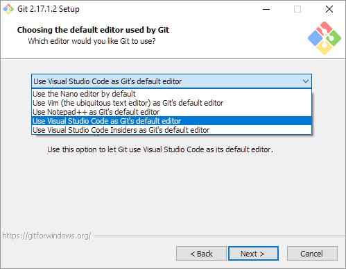
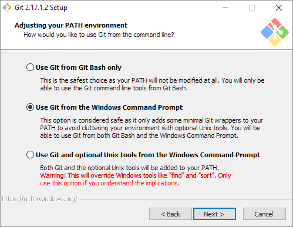

# Git
Git is a distributed version control system used to manage changes to text files. 

# OS/X

On OS/X, git is part of the xcode command line tools. To install them:

1. Open a [terminal](osx_terminal).

2. Type the following in the terminal:
```bash
xcode-select --install
```
3. [Test install](#test-install)

# Windows
As part of installing git, install the gitbash command line environment so that the command line is consistent across Windows, OSX and Linux.

1. Download git for windows:
https://git-scm.com/download/win

2. *Click* on the git installer:


3. *Click* through the installation steps (keeping the defaults) until you reach the "Choosing the default editor used by Git" window. Select `Visual Studio Code` as the default editor. *Click* `Next`:



5. Choose the "Use Git from the Windows Command Prompt" radio button and then *click* `Next`:

 

6. *Click* through the next few installation windows using the defaults. On the configureing the terminal emulator to use with Git Bash window, choose the "Use Windows default console window" option:


7. *Click* through the rest of the install, leaving the defaults, and then *click* `Finish` on the last window: 


3. [Test install](#test-install)

## Test Install

Test that git is installed:

1. Open a [windows](windows_terminal.md) or [OS/X](osx_terminal.md) terminal. 

2. Type the following into the terminal:
```bash
 git
 ```

The terminal should print something like:

```bash
usage: git [--version] [--help] [-C <path>] [-c name=value]
           [--exec-path[=<path>]] [--html-path] [--man-path] [--info-path]
           [-p | --paginate | --no-pager] [--no-replace-objects] [--bare]
           [--git-dir=<path>] [--work-tree=<path>] [--namespace=<name>]
           <command> [<args>]


```
