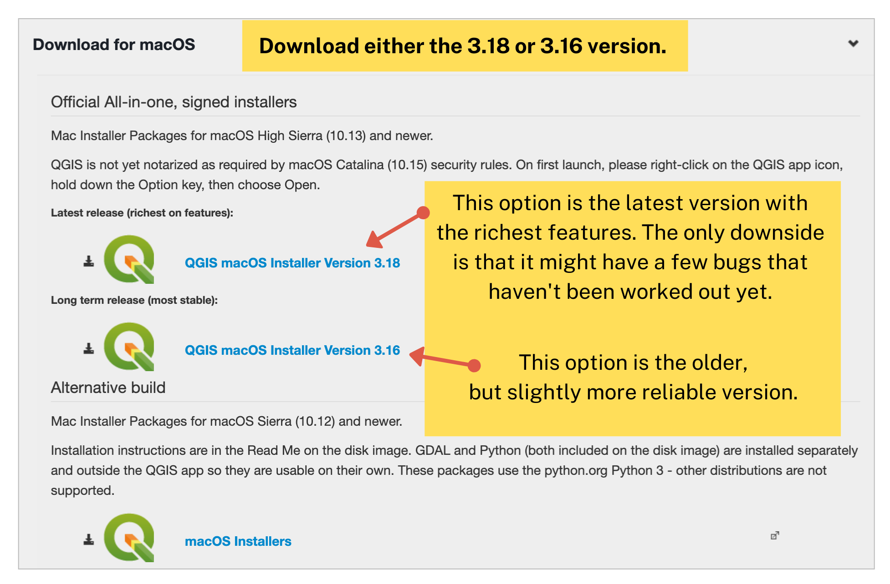
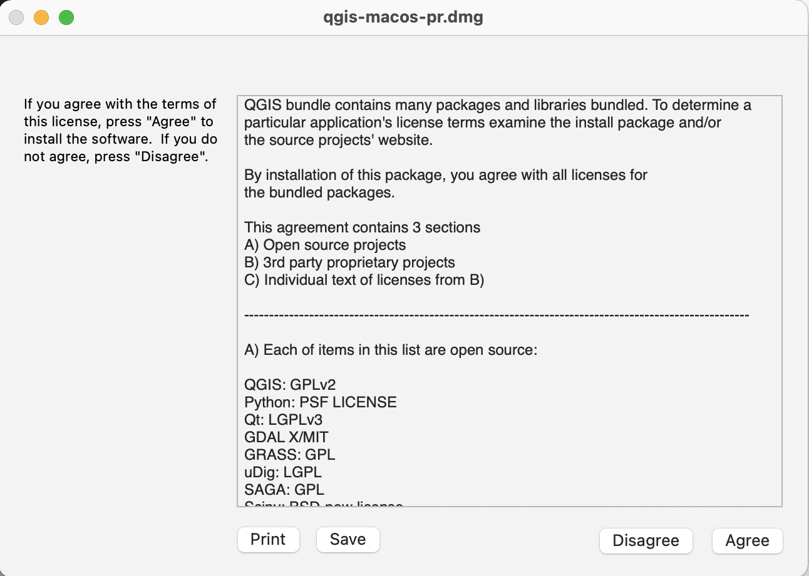
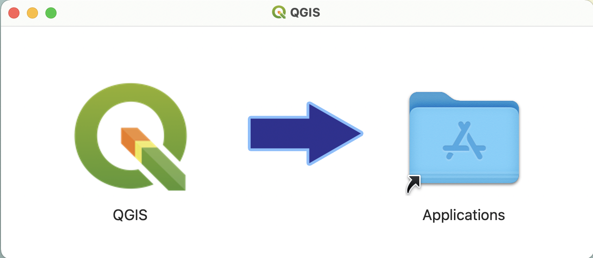
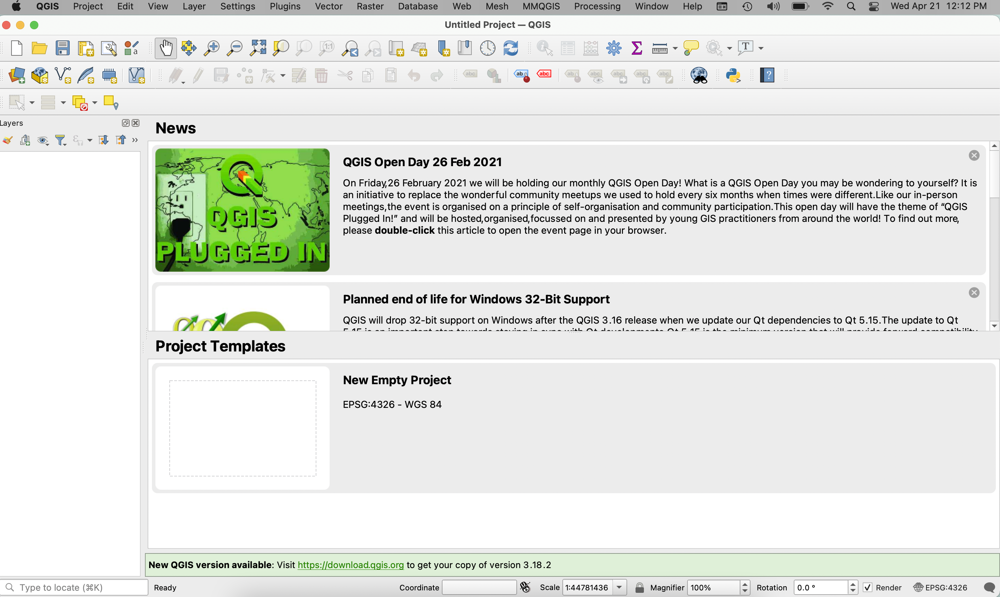

# QGIS

[QGIS](http://www.qgis.org/en/site/) is a free and open source Geographical Information System. 

## Download
* Download __QGIS Version 3.16__ from https://qgis.org/en/site/forusers/download.html:

## Windows:

1. [Download](<https://qgis.org/en/site/forusers/download.html>)

2. Follow the instructions provided by the installer you downloaded.  

3. [Test install](#test-install)

## macOS:

1. [Download](<https://qgis.org/en/site/forusers/download.html>)

2. After opening the install package, you will be taken through a prompt. Follow the instructions.

3. After the package installs, move the QGIS application into your applications.

3. [Test install](#test-install)

#### Troubleshooting
You may need to change [security & privacy settings](https://support.apple.com/en-us/HT202491) to allow app downloads from outside sources.

## Test Install

1. Navigate to your applications and click on QGIS.

2. You will likely receive an error that says ““QGIS” can’t be opened because Apple cannot check it for malicious software.”

3. To troubleshoot this, go back to your applications and this time instead of double-clicking on the QGIS app, right-click and select “Open.” Then when prompted again, select “Open.”

4. Note that after this point you will be able to open the app by simply double-clicking on it. 
 
 Launch __QGIS 3.16. A new project will look like this:

