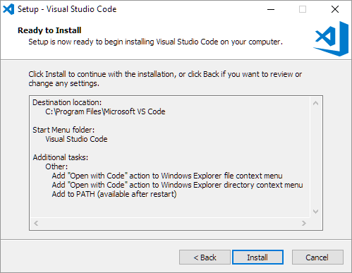
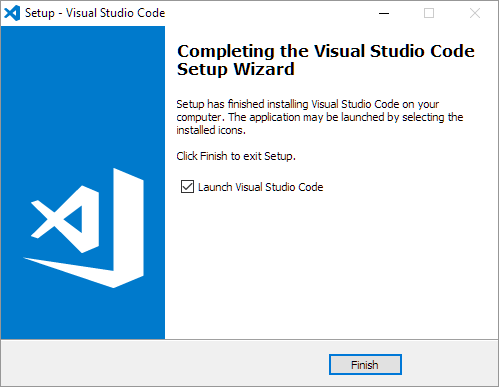
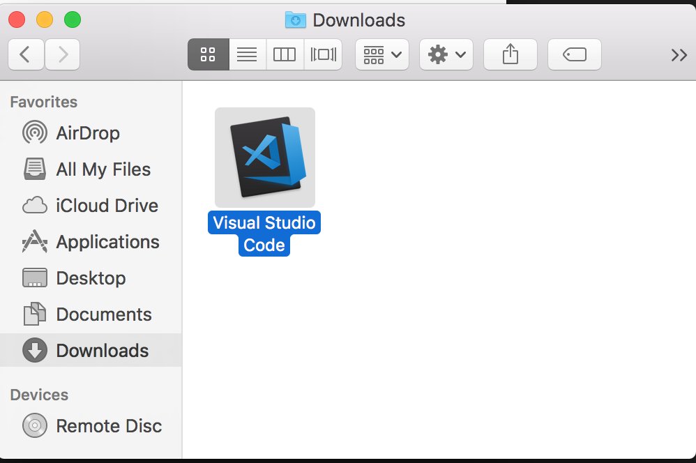
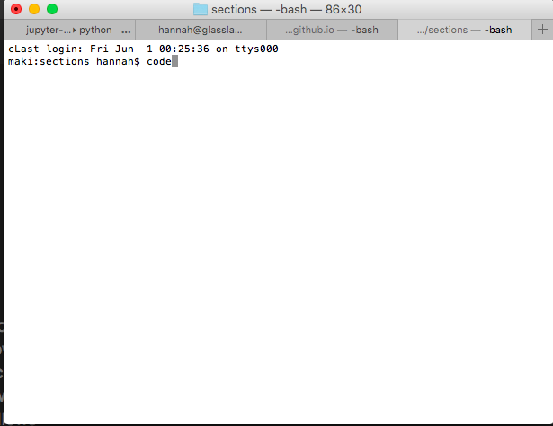
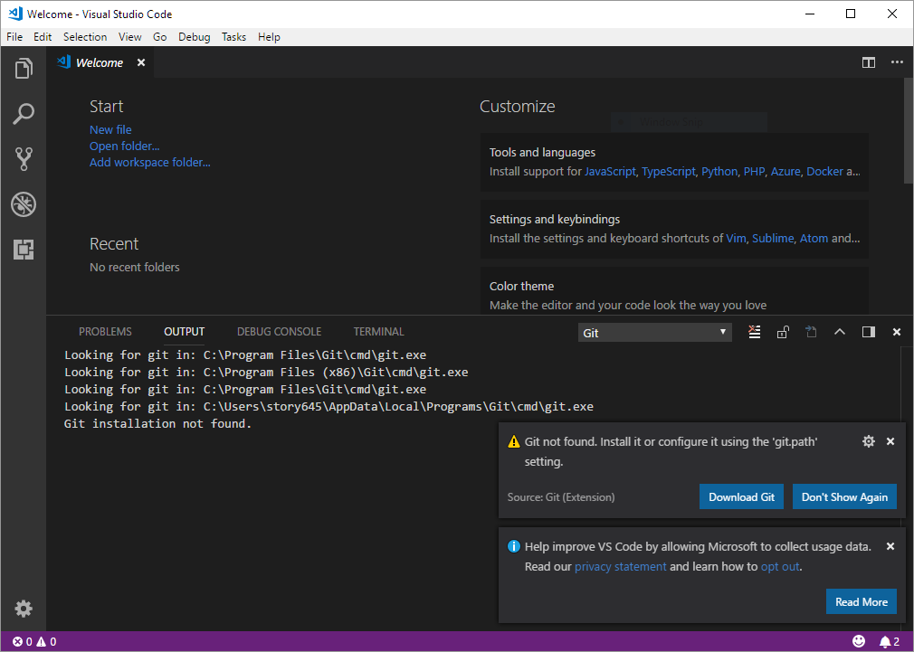

# Visual Studio Code
A text editor is a simple notepad type application. For the DRI, we will be using the VSCode text editor because it supports [syntax highlighting](https://en.wikipedia.org/wiki/Syntax_highlighting), is free and open source, and is consistent across OSX, Windows, and Linux systems.

## Install
Download VSCode at https://code.visualstudio.com/ 
* [OS/X instructions](#os/x)
* [Windows instructions](#windows)

### Windows
1. *Click* on the VScode installer in your downloads folder:

2. When you see this window, *click* `Next`:

 
 
 3. Accept the license agreement by *selecting* the first radio button. Then *click* `next`  
 
 
 
 4. Choose the folder on the computer that VSCode should be installed in (the default is usually fine). Then *click* `Next`:
 
 
 
 4b. Windows only: Choose the folder in the start menu that VSCode should be installed in. Then *click* `Next`:
 
 
 
 4c. Windows only: Please *check* the box that says `Add to PATH`, which is the fifth (last) box. Check the other boxes at your own discretion. Then *click* `Next`:
 
 

5. You should see a window listing the configurations you chose in the previous steps. If they are incorrect, *click* `Back` and redo the previous steps. If they are correct, *click* `Install`:

 

6. Sit back and relax because the install will take a while. You should see a window with a progress bar similar to this:

 

7. *Check* the "Launch Visual Studio Code" checkbox and then *click* `Next`

8. [Test Install](#test-install)

### OS/X

To open code from the osx terminal (command line), we need to [add it to path](https://code.visualstudio.com/docs/setup/mac) after the install.

1. [Download VSCode](#download)

1. Drag the Visual Studio Code application to `Applications` folder. 

1. Open VSCode via your preferred method.  *Click* on the icon:

2. Navigate to the `View->Command Pallet` menu and *click* on `command`

3. The `Command Pallet` menu looks like this. *Type* `shell` into the text bar. Then choose "Shell Command: Install `code` command in PATH" 

4. Once the install is finished, you should be able to open a [terminal](osx_terminal.md) and *type* `code` and that should launch VSCode

8. [Test Install](#test-install)

## Test Install

VSCode should now be installed. You should see something like this window when you launch VSCode:

Ignore the warnings about git not being installed. 